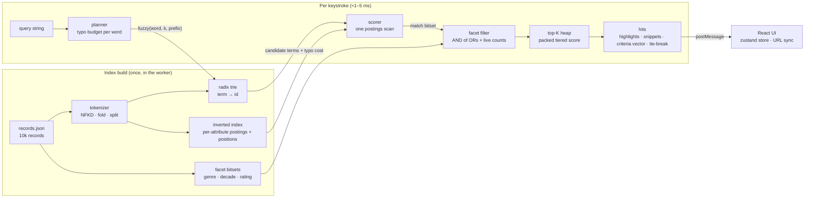

# Sift

**A from-scratch, typo-tolerant, search-as-you-type engine running in a Web Worker over 10,000 records — with faceting, highlighting, a live latency readout and a per-hit "why does this rank here" explainer.**


No search library, no server, no network at runtime. Everything in `src/engine/` — tokenizer, compressed radix trie, bounded Damerau-Levenshtein traversal, positional inverted index, tiered ranker, bitset facets, highlighter — is hand-written, dependency-free TypeScript that runs identically in Node, in a Web Worker and in the test suite.

## Why I built this

Instant-search products feel like magic: you mistype "matrx" and *The Matrix* is already on screen before you notice the typo. I wanted to understand exactly what happens between keystroke and result — not by wiring up a hosted API, but by building the whole pipeline and making every ranking decision inspectable. The result is a small engine that answers a query over 10k records in a couple of milliseconds, plus a UI that shows the raw criteria vector behind each hit and *which* criterion broke the tie against the hit above it.

## Features

- **10,000-record bundled dataset** — generated deterministically by `scripts/generate-dataset.ts` (seeded xoshiro128\*\*), so the repo needs no network. A few dozen hand-written anchor titles (The Matrix, Blade Runner, Amélie…) plus procedurally assembled movie-style records with title, logline, genres, year, rating and popularity.
- **Unicode-aware tokenizer** — NFKD fold, diacritics stripped (`Amélie` → `amelie`, `fi` → `fi`), lowercase, camelCase and hyphen splitting (`BladeRunner`, `sci-fi`), apostrophes as joiners (`Ocean's` → `oceans`). Token offsets point into the *original* string so highlights preserve case and accents.
- **Positional inverted index** — per-attribute postings (`title`, `genres`, `description`) with token positions, built as a two-pass counting sort over typed arrays.
- **Compressed radix trie** with prefix enumeration and **bounded Damerau-Levenshtein traversal** (row-by-row DP carried down trie edges, subtree pruning when the row minimum exceeds the budget). 1 typo for words ≥ 4 chars, 2 for ≥ 8. In prefix mode a term matches if *any* prefix of it is within budget — what search-as-you-type needs for the word being typed.
- **Tiered ranking**, exactly in this order: typos → matched words → proximity → attribute (title > genres > description) → exactness (exact > prefix) → popularity. The six bounded integers are packed into one double so the hot path sorts plain numbers; the same vector is exposed unpacked on every hit.
- **Faceted filtering with live counts** — genre, decade and rating bucket, each value a `Uint32Array` bitset. Multi-select within a facet is OR, across facets is AND; counts are *disjunctive* (what you would get by adding that value), computed with word-parallel AND + popcount.
- **Highlighting and snippets** — matched tokens wrapped in `<mark>`, snippets windowed around the densest cluster of matches.
- **Web Worker execution** — hand-rolled `postMessage` protocol (no Comlink). Every keystroke queries with **0 ms debounce**; out-of-order answers are detected by request id and dropped. The monospace latency pill shows engine ms, UI↔worker round-trip ms and hit count, and flashes green on every result.
- **"Why #N?" explainer** per hit — the six-criterion vector, the criterion that separated it from the previous hit, and the index terms each query word matched (exact / prefix / typo count).
- **API playground** — a bottom drawer with an editable mock `POST /1/indexes/records/query` JSON body, the raw engine response, and copy buttons (response JSON and as `curl`). `Ctrl/⌘ + Enter` runs.
- **Keyboard navigation** — `/` focuses the bar, `↑`/`↓` move the active hit, `Enter` opens its explainer, `Esc` closes / clears.
- **URL-synced state** — `?q=&genre=&decade=&rating=&page=` round-trips through the address bar; `&explain=N` deep-links to an open explainer.
- **Zero-results state** with "did you mean" suggestions from the trie, verified against the index so only queries that actually return hits are offered.
- Light-first developer-tool UI with automatic dark mode (`prefers-color-scheme`), self-hosted Inter + JetBrains Mono, responsive down to ~380 px.

## How it works



**Query planning.** The query is tokenized; every word gets a typo budget (0 / 1 / 2 by length) and the last word is treated as a prefix unless the query ends in whitespace. Each word is expanded over the trie into candidate index terms with a cost: exact (0 typos, full match), prefix (0 typos, partial), or typo (1–2 edits, ranked by document frequency and capped).

**Scoring.** A single pass over the postings of every candidate accumulates, per document, a matched-word bitmask, the minimum typo count per word, an exact-match bitmask, the best attribute, and a linked chain of (word, attribute, term, positions) entries. All scratch state is typed arrays sized once per index and reused, so a query allocates almost nothing. Proximity is computed lazily (only for documents that matched ≥ 2 words) as the summed minimum in-attribute distance between consecutive query words.

**Ranking.** `packScore()` folds the six criteria into a 46-bit integer inside a double, so a bounded min-heap of size `(page + 1) × hitsPerPage` selects the page in O(n log k). For the returned page, the same criteria are unpacked and `findTieBreak(previous, current)` reports the first criterion that differs — that is what the "Why #N?" popover shows.

**Facets.** The scorer's match bitset is ANDed with each facet's OR-ed selection to produce the filtered result; per-value counts are `popcount(scope ∧ bits(value))` where `scope` excludes the facet's own selection, giving the "what if I also pick this" numbers instant-search UIs expect.

## Performance

Measured with `npm run bench` (Node v26.7, 1,000 seeded queries mixing single words, as-you-type prefixes, injected typos, two- and three-word phrases and faceted queries; numbers from `docs/bench.json` on an otherwise idle laptop):

| Metric | Value |
| --- | --- |
| Records / distinct terms / postings | 10,000 / 1,270 / 375,025 |
| Index build (Node) | 452 ms |
| Index build (worker, Chromium) | ~280 ms |
| Approx. typed-array footprint | 3.8 MB |
| Query latency p50 | **1.46 ms** |
| Query latency p95 | **4.78 ms** |
| Query latency p99 | 10.6 ms |
| Mean hits per query | 3,470 |

Per query kind (p50 / p95, ms): word 1.31 / 4.05 · prefix 1.63 / 4.37 · typo 1.20 / 4.22 · two words 1.71 / 4.06 · three words 2.32 / 6.24 · faceted 0.85 / 3.24. The bench exits non-zero if p95 exceeds 20 ms. Latency scales with the number of documents touched, not with the corpus size per se — short prefixes over common words touch most of the 10k records and sit at the top of the distribution.

## Run, test, bench

```bash
npm ci
npm run dev        # Vite dev server
npm run build      # tsc -b (strict, zero errors) + vite build
npm test           # vitest: tokenizer, Damerau-Levenshtein, trie, fuzzy search, ranker, facets,
                   #         highlighter, dataset determinism, engine-level ranking, URL sync, protocol
npm run bench      # index 10k records, run 1k queries, print p50/p95/p99, write docs/bench.json
npm run dataset    # regenerate public/data/records.json (deterministic; optional count + seed args)
```

The engine folder has no third-party imports:

```bash
grep -rn 'from "' src/engine | grep -v 'from "\.'   # → no output
```

## Deploy to Vercel

The app is fully static (the dataset ships in `public/data/`). `vercel.json` sets the Vite framework preset, a SPA rewrite and long-lived cache headers for `/assets` and `/data`.

```bash
npm i -g vercel
vercel          # preview
vercel --prod   # production
```

## Inspired by

The concept — instant, typo-tolerant search with tiered ranking, disjunctive facets and a `_rankingInfo`-style explanation — is inspired by [Algolia](https://www.algolia.com) (YC W14). The response shape deliberately echoes theirs (`hits`, `nbHits`, `processingTimeMS`, `_highlightResult`, `facetFilters`) so the playground reads like a familiar API. The engine, ranking implementation, dataset and UI are original; nothing here uses Algolia's code or services.

## Project layout

```
src/engine/          dependency-free, DOM-free engine (also the unit under test)
  tokenizer.ts       NFKD fold, split rules, offsets
  trie.ts            radix trie + bounded Damerau-Levenshtein walk
  levenshtein.ts     OSA distance with cut-off
  inverted-index.ts  per-attribute positional postings
  query-planner.ts   word → candidate terms with typo cost
  scorer.ts          postings scan → criteria per doc
  ranker.ts          tiered comparator, packed score, tie-break finder
  facets.ts          bitset facets + disjunctive counts
  highlight.ts       <mark> wrapping, densest-window snippets
  suggest.ts         did-you-mean over the trie
  search-index.ts    public facade
src/worker/          search.worker.ts + hand-rolled protocol + UI client
src/lib/url.ts       URL ↔ state (pure, tested)
src/store.ts         zustand store owning the worker
src/components/      search bar, facet rail, hit cards, explainer, playground
scripts/             generate-dataset.ts, bench.ts
```

## License

MIT © 2026 Jafn
